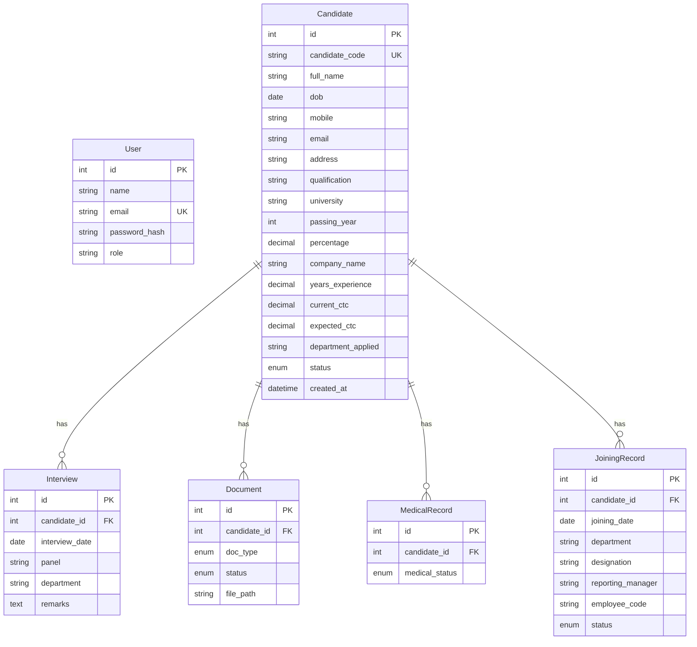

<p align="center">
  <h1 align="center">🏥 Pre-Onboarding Connect</h1>
  <p align="center">
    <strong>Pre-Onboarding & Recruitment Automation Portal for HR</strong>
  </p>
  <p align="center">
    A full-stack web application that streamlines the recruitment pipeline — from candidate registration to employee onboarding — built for the HR department of a pharmaceutical company.
  </p>
  <p align="center">
    
    
    
    
    
    
  </p>
</p>

---

## 📋 Table of Contents

- [Overview](#-overview)
- [Features](#-features)
- [Tech Stack](#-tech-stack)
- [Project Structure](#-project-structure)
- [Getting Started](#-getting-started)
  - [Prerequisites](#prerequisites)
  - [Backend Setup](#backend-setup)
  - [Frontend Setup](#frontend-setup)
  - [One-Command Startup](#one-command-startup)
- [Default Credentials](#-default-credentials)
- [Architecture](#-architecture)
  - [Data Model](#data-model)
  - [Entity Relationship Diagram](#entity-relationship-diagram)
  - [Status Enums](#status-enums)
  - [Candidate ID Format](#candidate-id-format)
- [API Reference](#-api-reference)
- [Frontend Pages](#-frontend-pages)
- [Security](#-security)
- [Testing](#-testing)
- [Scripts](#-scripts)
- [Environment Variables](#-environment-variables)
- [License](#-license)

---

## 🔍 Overview

**Lupin Pre-Onboarding Connect** bridges the gap between recruitment and formal onboarding in a company's HRIS (Employee Connect). It covers the complete pre-onboarding lifecycle:

```
Recruitment → Interview → Document Verification → Medical Tracking → Joining
```

This is a **prototype/internship project** and is not connected to any real company system. All demo/seed data uses synthetic, obviously fake values.

---

## ✨ Features

### 📊 HR Dashboard
- Real-time pipeline funnel visualization (New → Shortlisted → Interview → Selected → Joined)
- Department-wise candidate breakdown
- Recent activity feed (last 10 applications)
- Aggregate statistics at a glance

### 👥 Candidate Management
- Public candidate registration form (no login required)
- Auto-generated candidate IDs (`LUP-TAR-2026-001` format)
- Full candidate profile with personal, education, and experience details
- Status tracking through the recruitment pipeline
- Search, filter, and sort capabilities
- Candidate detail view with complete PII (HR-only)

### 🗓️ Interview Management
- Schedule interviews with panel members, date, and department
- Add remarks and feedback post-interview
- Per-candidate interview history
- List view with filtering

### 📄 Document Checklist
- 8 document types tracked: Aadhaar, PAN, Photo, Resume, Education Certificate, Experience Letter, Salary Proof, Bank Details
- Document status tracking (Pending / Complete)
- Secure file uploads with server-side MIME type & size validation (max 5 MB)
- Files stored in a non-web-root `/uploads` directory

### 🏥 Medical Tracker
- Track medical examination status per candidate
- Status flow: `Sent for medical` → `Report received` → `Fit` / `Not Fit`
- List and detail views

### 🤝 Joining Tracker
- Manage post-selection joining process
- Record joining date, department, designation, and reporting manager
- Auto-generate employee codes upon status change to "Joined"
- Status flow: `Pending` → `Joined`

### 📈 Reports & Exports
- **Excel Export**: Full candidate list as a styled `.xlsx` file with headers, alternating rows, and frozen panes
- **PDF Export**: Pipeline summary report with funnel table, department breakdown, and confirmed joinings (generated via ReportLab)

### 🔐 Authentication & Authorization
- JWT-based session management
- bcrypt password hashing
- Role-based access control (HR Admin)
- Protected dashboard and API routes
- Public-only access: candidate registration form and login page

---

## 🛠️ Tech Stack

| Layer          | Technology                                    |
|----------------|-----------------------------------------------|
| **Frontend**   | React 18, Next.js 14 (App Router), TypeScript |
| **Styling**    | Tailwind CSS 3.4                              |
| **HTTP Client**| Axios                                         |
| **Backend**    | FastAPI 0.111, Python 3.11+                   |
| **ORM**        | SQLAlchemy 2.0                                |
| **Migrations** | Alembic 1.13                                  |
| **Database**   | SQLite (local/demo), PostgreSQL-ready          |
| **Auth**       | JWT (python-jose), bcrypt (passlib)           |
| **Validation** | Pydantic v2                                   |
| **PDF Export** | ReportLab                                     |
| **Excel Export**| openpyxl                                     |

---

## 📁 Project Structure

```
lupin-pre-onboarding/
├── backend/
│   ├── alembic/                    # Database migrations
│   │   ├── versions/
│   │   │   ├── 0001_initial_schema.py
│   │   │   └── 0002_candidate_code_not_null.py
│   │   └── env.py
│   ├── alembic.ini                 # Alembic configuration
│   ├── app/
│   │   ├── __init__.py
│   │   ├── config.py               # App settings (Pydantic BaseSettings)
│   │   ├── database.py             # SQLAlchemy engine & session
│   │   ├── dependencies.py         # JWT auth & role-based access guards
│   │   ├── main.py                 # FastAPI app entrypoint
│   │   ├── models/                 # SQLAlchemy ORM models
│   │   │   ├── __init__.py
│   │   │   ├── candidate.py        # Candidate + CandidateStatus enum
│   │   │   ├── document.py         # Document + DocType/DocumentStatus enums
│   │   │   ├── interview.py        # Interview
│   │   │   ├── joining.py          # JoiningRecord + JoiningStatus enum
│   │   │   ├── medical.py          # MedicalRecord + MedicalStatus enum
│   │   │   └── user.py             # User (HR admin)
│   │   ├── routers/                # API route handlers
│   │   │   ├── auth.py             # POST /auth/login
│   │   │   ├── candidates.py       # CRUD /candidates
│   │   │   ├── dashboard.py        # GET /dashboard/stats
│   │   │   ├── documents.py        # CRUD /documents
│   │   │   ├── interviews.py       # CRUD /interviews
│   │   │   ├── joining.py          # CRUD /joining
│   │   │   ├── medical.py          # CRUD /medical
│   │   │   ├── reports.py          # GET /reports/export/excel|pdf
│   │   │   └── tests/              # Test stubs for each router
│   │   └── schemas/                # Pydantic request/response schemas
│   │       ├── auth.py
│   │       ├── candidate.py
│   │       ├── document.py
│   │       ├── interview.py
│   │       ├── joining.py
│   │       ├── medical.py
│   │       └── user.py
│   ├── scripts/
│   │   ├── seed_admin.py           # Seed default HR admin user
│   │   └── seed_demo_data.py       # Seed synthetic demo data
│   ├── uploads/                    # File upload storage (non-web-root)
│   └── requirements.txt
│
├── frontend/
│   ├── src/
│   │   ├── app/
│   │   │   ├── (auth)/login/       # Login page
│   │   │   ├── (dashboard)/        # Protected HR dashboard layout
│   │   │   │   ├── layout.tsx      # Sidebar + auth guard wrapper
│   │   │   │   ├── dashboard/      # Main dashboard with stats
│   │   │   │   ├── candidates/     # Candidate list + [id] detail
│   │   │   │   ├── interviews/     # Interview list + [id] detail
│   │   │   │   ├── documents/      # Document checklist + [id] detail
│   │   │   │   ├── medical/        # Medical tracker + [id] detail
│   │   │   │   ├── joining/        # Joining tracker + [id] detail
│   │   │   │   └── reports/        # Export reports page
│   │   │   ├── register/           # Public candidate registration form
│   │   │   ├── globals.css
│   │   │   ├── layout.tsx          # Root layout
│   │   │   └── page.tsx            # Root redirect
│   │   ├── components/
│   │   │   ├── Sidebar.tsx         # Navigation sidebar
│   │   │   ├── StatusBadge.tsx     # Color-coded status badges
│   │   │   └── ComingSoon.tsx      # Placeholder component
│   │   └── lib/
│   │       ├── api.ts              # Axios instance configuration
│   │       └── auth.ts             # Auth helper utilities
│   ├── next.config.mjs             # API proxy rewrites to backend
│   ├── tailwind.config.ts
│   ├── tsconfig.json
│   └── package.json
│
├── dev.sh                          # One-command dev startup (single terminal)
├── start.sh                        # One-command startup (separate terminals, macOS)
├── AGENTS_1.md                     # Agent context / project spec
└── .gitignore
```

---

## 🚀 Getting Started

### Prerequisites

- **Python 3.11+** — [python.org](https://www.python.org/downloads/)
- **Node.js 18+** — [nodejs.org](https://nodejs.org/)
- **npm** (comes with Node.js)
- **Git**

### Backend Setup

```bash
# 1. Navigate to backend
cd backend

# 2. Create and activate a virtual environment
python -m venv .venv
source .venv/bin/activate        # macOS/Linux
# .venv\Scripts\activate         # Windows

# 3. Install dependencies
pip install -r requirements.txt

# 4. Run database migrations
alembic upgrade head

# 5. Seed the default HR admin user
python scripts/seed_admin.py

# 6. (Optional) Seed demo/synthetic data
python scripts/seed_demo_data.py

# 7. Start the backend server
uvicorn app.main:app --reload --port 8000
```

The backend will be available at:
- **API**: http://localhost:8000
- **Swagger Docs**: http://localhost:8000/docs
- **ReDoc**: http://localhost:8000/redoc

### Frontend Setup

```bash
# 1. Navigate to frontend
cd frontend

# 2. Install dependencies
npm install

# 3. Start the development server
npm run dev
```

The frontend will be available at http://localhost:3000

### One-Command Startup

Two convenience scripts are provided for starting both servers simultaneously:

#### Option 1: `dev.sh` (single terminal, recommended)

```bash
chmod +x dev.sh    # one-time only
./dev.sh
```

This runs both servers in the background, applies migrations, and opens the app in your browser. Press `Ctrl+C` to stop both servers.

#### Option 2: `start.sh` (separate Terminal windows, macOS only)

```bash
chmod +x start.sh   # one-time only
./start.sh
```

This opens each server in its own Terminal window via AppleScript.

---

## 🔑 Default Credentials

| Field      | Value                    |
|------------|--------------------------|
| **Email**  | `admin@lupin-hr.local`   |
| **Password** | `Admin@123`            |
| **Role**   | `hr_admin`               |

> ⚠️ **Change these credentials before any non-local deployment.**

---

## 🏗️ Architecture

### Data Model

The application manages six core entities:

| Entity            | Description                                          |
|-------------------|------------------------------------------------------|
| **User**          | HR admin accounts with bcrypt-hashed passwords       |
| **Candidate**     | Applicant records with personal, education & experience data |
| **Interview**     | Interview schedule, panel, department, and remarks    |
| **Document**      | Document checklist with 8 types and file upload paths |
| **MedicalRecord** | Medical examination status tracking                  |
| **JoiningRecord** | Post-selection joining details and employee code      |

### Entity Relationship Diagram



### Status Enums

| Entity         | Field            | Allowed Values                                                         |
|----------------|------------------|------------------------------------------------------------------------|
| Candidate      | `status`         | `New Application`, `Shortlisted`, `Interview Scheduled`, `Selected`, `Rejected`, `Hold` |
| Document       | `status`         | `Pending`, `Complete`                                                  |
| Document       | `doc_type`       | `aadhaar`, `pan`, `photo`, `resume`, `education_cert`, `experience_letter`, `salary_proof`, `bank_details` |
| MedicalRecord  | `medical_status` | `Sent for medical`, `Report received`, `Fit`, `Not Fit`               |
| JoiningRecord  | `status`         | `Pending`, `Joined`                                                    |

### Candidate ID Format

Candidate codes follow the pattern:

```
LUP-TAR-{YEAR}-{SEQ}
```

- `{YEAR}` — Current calendar year (e.g., `2026`)
- `{SEQ}` — Zero-padded 3-digit sequence number, resetting each year
- Example: `LUP-TAR-2026-001`, `LUP-TAR-2026-002`
- Generated **server-side inside a transaction** — never on the frontend

---

## 📡 API Reference

All API routes (except login and public registration) require a valid JWT Bearer token with the `hr_admin` role.

| Method   | Endpoint                       | Auth     | Description                            |
|----------|-------------------------------|----------|----------------------------------------|
| `POST`   | `/auth/login`                 | Public   | Authenticate and receive JWT token     |
| `GET`    | `/health`                     | Public   | Liveness check                         |
| `GET`    | `/dashboard/stats`            | HR Only  | Aggregated funnel stats & activity     |
| `GET`    | `/candidates`                 | HR Only  | List all candidates (summary view)     |
| `POST`   | `/candidates`                 | Public   | Register a new candidate               |
| `GET`    | `/candidates/{id}`            | HR Only  | Get full candidate details             |
| `PUT`    | `/candidates/{id}`            | HR Only  | Update candidate info/status           |
| `DELETE` | `/candidates/{id}`            | HR Only  | Delete a candidate                     |
| `GET`    | `/interviews`                 | HR Only  | List all interviews                    |
| `POST`   | `/interviews`                 | HR Only  | Schedule a new interview               |
| `GET`    | `/interviews/{id}`            | HR Only  | Get interview details                  |
| `PUT`    | `/interviews/{id}`            | HR Only  | Update interview                       |
| `DELETE` | `/interviews/{id}`            | HR Only  | Delete interview                       |
| `GET`    | `/documents`                  | HR Only  | List all documents                     |
| `POST`   | `/documents`                  | HR Only  | Create document record                 |
| `GET`    | `/documents/{id}`             | HR Only  | Get document details                   |
| `PUT`    | `/documents/{id}`             | HR Only  | Update document status/upload file     |
| `DELETE` | `/documents/{id}`             | HR Only  | Delete document record                 |
| `GET`    | `/medical`                    | HR Only  | List all medical records               |
| `POST`   | `/medical`                    | HR Only  | Create medical record                  |
| `GET`    | `/medical/{id}`               | HR Only  | Get medical record details             |
| `PUT`    | `/medical/{id}`               | HR Only  | Update medical status                  |
| `DELETE` | `/medical/{id}`               | HR Only  | Delete medical record                  |
| `GET`    | `/joining`                    | HR Only  | List all joining records               |
| `POST`   | `/joining`                    | HR Only  | Create joining record                  |
| `GET`    | `/joining/{id}`               | HR Only  | Get joining record details             |
| `PUT`    | `/joining/{id}`               | HR Only  | Update joining info/status             |
| `DELETE` | `/joining/{id}`               | HR Only  | Delete joining record                  |
| `GET`    | `/reports/export/excel`       | HR Only  | Download candidate list as `.xlsx`     |
| `GET`    | `/reports/export/pdf`         | HR Only  | Download pipeline summary as `.pdf`    |

> 💡 **Interactive API Docs**: Visit http://localhost:8000/docs for the full Swagger UI with try-it-out functionality.

---

## 🖥️ Frontend Pages

| Route                          | Access   | Description                                      |
|-------------------------------|----------|--------------------------------------------------|
| `/`                           | Public   | Redirects to login                               |
| `/login`                      | Public   | HR admin login page                              |
| `/register`                   | Public   | Candidate self-registration form                 |
| `/dashboard`                  | HR Only  | Pipeline stats, funnel, department charts         |
| `/candidates`                 | HR Only  | Candidate list (name + status + ID only)          |
| `/candidates/[id]`            | HR Only  | Full candidate detail view (including PII)        |
| `/interviews`                 | HR Only  | Interview schedule list                          |
| `/interviews/[id]`            | HR Only  | Interview detail & edit                          |
| `/documents`                  | HR Only  | Document checklist overview                      |
| `/documents/[id]`             | HR Only  | Per-candidate document management & file upload   |
| `/medical`                    | HR Only  | Medical tracker list                             |
| `/medical/[id]`               | HR Only  | Medical status detail & update                   |
| `/joining`                    | HR Only  | Joining tracker list                             |
| `/joining/[id]`               | HR Only  | Joining detail & employee code generation         |
| `/reports`                    | HR Only  | Export reports (Excel & PDF downloads)            |

The frontend proxies all `/api/*` requests to `http://localhost:8000/*` via Next.js rewrites configured in `next.config.mjs`.

---

## 🔐 Security

This application implements several non-negotiable security measures:

1. **Password Hashing** — All passwords are bcrypt-hashed using `passlib`. Plaintext passwords are never logged, stored, or returned.

2. **JWT Authentication** — Every protected API route requires a valid Bearer token. Tokens are signed with HS256 and expire after 48 hours (configurable).

3. **Role-Based Access Control** — The `require_hr_role` dependency guard ensures only users with the `hr_admin` role can access dashboard and management routes.

4. **File Upload Validation** — All uploads are validated server-side for MIME type and file size (max 5 MB) before saving. Files are stored in `/uploads`, which is never web-root exposed.

5. **Input Validation & Sanitization** — All form inputs are validated server-side using Pydantic schemas, not just client-side.

6. **PII Protection** — List/summary views only display candidate name, status, and ID. Full PII (Aadhaar, PAN, bank details) is only visible on the single-candidate detail view to authenticated HR users.

---

## 🧪 Testing

The project includes test stubs for every API router. To run the tests:

```bash
cd backend
source .venv/bin/activate
pytest
```

Test files are located in `backend/app/routers/tests/`:

| File                    | Coverage                    |
|-------------------------|-----------------------------|
| `test_candidates.py`   | Candidate CRUD operations   |
| `test_interviews.py`   | Interview management        |
| `test_documents.py`    | Document checklist           |
| `test_medical.py`      | Medical tracker             |
| `test_joining.py`      | Joining tracker             |
| `test_dashboard.py`    | Dashboard statistics        |
| `test_reports.py`      | Excel/PDF export            |

---

## 📜 Scripts

| Script                              | Description                                            |
|--------------------------------------|-------------------------------------------------------|
| `dev.sh`                            | Start both servers in a single terminal (recommended)  |
| `start.sh`                          | Start servers in separate Terminal windows (macOS)      |
| `backend/scripts/seed_admin.py`     | Create the default HR admin user (idempotent)          |
| `backend/scripts/seed_demo_data.py` | Populate the database with synthetic demo data         |

---

## ⚙️ Environment Variables

The backend reads configuration from environment variables or a `.env` file in the `backend/` directory:

| Variable                     | Default                                       | Description                          |
|------------------------------|-----------------------------------------------|--------------------------------------|
| `DATABASE_URL`               | `sqlite:///./lupin_onboarding.db`             | Database connection string           |
| `SECRET_KEY`                 | `CHANGE_ME_IN_PRODUCTION_USE_STRONG_RANDOM_KEY` | JWT signing secret                 |
| `ALGORITHM`                  | `HS256`                                       | JWT algorithm                        |
| `ACCESS_TOKEN_EXPIRE_HOURS`  | `48`                                          | Token expiry in hours                |
| `APP_NAME`                   | `Lupin Pre-Onboarding Connect`                | Application display name             |
| `DEBUG`                      | `true`                                        | Debug mode flag                      |

> ⚠️ **Always override `SECRET_KEY`** with a strong, random value for any non-local deployment.

---

## 📝 Coding Conventions

| Area       | Convention                                                                 |
|------------|---------------------------------------------------------------------------|
| Backend    | `snake_case` for Python, Pydantic models for request/response schemas     |
| Frontend   | PascalCase components, one component per file, Tailwind utility classes   |
| Testing    | Every new API route gets a corresponding test stub                        |
| Data       | All seed/demo data uses obviously fake values — never realistic PII       |

---

## 📄 License

This project is a prototype built for educational/internship purposes. Not intended for production use.

---

<p align="center">
  Built with ❤️ by <a href="https://github.com/MrugankPatil">Mrugank Patil</a>
</p>
